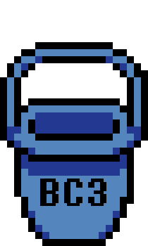

<p align="center">
  
</p>

<p align="center">
  <picture>
    <source media="(prefers-color-scheme: dark)" srcset="assets/logo_white.png">
    <source media="(prefers-color-scheme: light)" srcset="assets/logo_black.png">
    
  </picture>
</p>

<p align="center">
  <strong>Vita Texture Cache Builder</strong><br>
  Builds validated RGBA4444 and BC3 texture caches for DeltaruneVita.
</p>

---

# DeltaCache

**DeltaCache** prepares external texture caches for **[DeltaruneVita](https://github.com/WolffsRoom/DeltaruneVita)** from a final, shipped `data.win`.

It generates both:

```text
RGBA4444 → page_NNN.r444
BC3/DXT5 → page_NNN.bc3.pvr
```

for every internal Texture Page, then validates the result against the same TXTR metadata the Vita Runner uses.

> DeltaCache does not include or distribute Deltarune game files. You must provide your own `data.win`.

## Why DeltaCache exists

DeltaruneVita can use different texture representations depending on the selected runtime mode.

Instead of converting textures on the Vita, DeltaCache prepares both representations offline:

```text
final data.win
     ↓
parse TXTR
     ↓
export Texture Pages
     ↓
build R444 + BC3
     ↓
validate against TXTR
     ↓
prepared package
```

The generated cache is tied to the exact `data.win` it was built from through:

```text
sourceSize
sourceOffset
width
height
```

This prevents stale cache files from being silently reused with a different Texture Page layout. The current tool reads these values directly from the final TXTR chunk. fileciteturn40file1L30-L45

---

## Features

- Builds `.r444` caches for every internal Texture Page
- Builds `.bc3.pvr` caches for every internal Texture Page
- Parses `FORM -> TXTR` directly from the final `data.win`
- Uses real TXTR `blobOffset`, `blobSize`, `width` and `height`
- Generates Runner-compatible 20-byte R444 headers
- Handles Chapter 3's separate VTC5/VTC6 cache version
- Generates and validates `complete.vtc`
- Validates PVR v3 / BC3 / sRGB metadata
- Performs a physical re-validation pass before marking a chapter complete
- Detects missing or extra cache files
- Supports external TXTR pages safely
- Produces per-chapter manifests
- Keeps the original input files untouched
- Supports automatic migration from nearby previous DeltaCache versions

---

## Project structure

```text
DeltaCache/
├─ assets/
├─ chapters/
├─ prepared/
├─ source/
├─ CHANGELOG_v0_3_6.md
├─ prepare_texture_cache_v0_3_6.bat
├─ README.md
└─ RUNTIME_SELECTION.md
```

### `assets/`

Repository branding and documentation assets.

Suggested files:

```text
assets/
├─ icon.png
├─ logo_black.png
└─ logo_white.png
```

### `chapters/`

Place the final `data.win` files here.

```text
chapters/
├─ 1/
│  └─ data.win
├─ 2/
│  └─ data.win
├─ 3/
│  └─ data.win
├─ 4/
│  └─ data.win
└─ 5/
   └─ data.win
```

The input must be the **final/shipped** `data.win` that will actually be used on the Vita. fileciteturn40file1L5-L13

### `prepared/`

Generated output is written here.

Do not commit generated game data to Git.

### `source/`

Contains the helper scripts and required tooling.

---

## Usage

Run:

```text
prepare_texture_cache_v0_3_6.bat
```

DeltaCache scans the available chapters, parses each TXTR and prepares both texture formats.

Typical output:

```text
prepared/
├─ chapter1/
│  ├─ data.win
│  ├─ texture_manifest.json
│  ├─ texture-cache/
│  │  ├─ page_000.r444
│  │  ├─ page_001.r444
│  │  ├─ ...
│  │  └─ complete.vtc
│  └─ pvr/
│     ├─ page_000.bc3.pvr
│     ├─ page_001.bc3.pvr
│     └─ ...
├─ chapter2/
├─ chapter3/
├─ chapter4/
├─ chapter5/
└─ prepared_manifest.json
```

This matches the current prepared layout documented by the tool. fileciteturn40file1L15-L27

---

## R444 format

Each `.r444` file contains:

```text
20-byte header
+
width * height * 2 bytes of raw RGBA4444
```

Header:

```text
uint32 magic
uint32 sourceSize
uint32 sourceOffset
uint32 width
uint32 height
```

All fields are little-endian.

The source fingerprint fields come directly from the final TXTR:

```text
sourceSize   = blobSize
sourceOffset = blobOffset
width        = TXTR width
height       = TXTR height
```

Pixels are stored raw, without zlib compression. fileciteturn40file1L30-L45

### Alpha packing

```text
A4 = 0                       if A == 0
A4 = min(15, (A + 15) >> 4) otherwise
```

### Cache magic

```text
Chapter 1 → VTC1
Chapter 2 → VTC1
Chapter 3 → VTC5
Chapter 4 → VTC1
Chapter 5 → VTC1
```

Chapter 3 intentionally uses a separate cache version. fileciteturn40file1L48-L59

---

## `complete.vtc`

After every required page has been generated and physically revalidated, DeltaCache writes:

```text
texture-cache/complete.vtc
```

Format:

```text
uint32 completeMagic
uint32 txtr.count
```

Magic:

```text
Chapter 1 → VTC2
Chapter 2 → VTC2
Chapter 3 → VTC6
Chapter 4 → VTC2
Chapter 5 → VTC2
```

Before creating this marker, the tool reopens all `.r444` and `.bc3.pvr` files from disk and checks their headers, dimensions, sizes, TXTR fingerprints and physical filenames. Missing or extra files abort preparation. fileciteturn40file1L62-L86

---

## TXTR parsing

DeltaCache parses the GameMaker container directly:

```text
FORM
  ↓
TXTR
```

The current implementation expects the Deltarune / GMS 2022.9 layout with 28-byte entries.

Relevant fields:

```text
+12 width
+16 height
+24 blobOffset
```

`blobSize` is calculated from the next non-zero `blobOffset`, or from the end of the TXTR chunk for the final blob.

External pages:

```text
ptr == 0
or
blobOffset == 0
```

are recorded in the manifest and do not receive external cache files. fileciteturn40file1L88-L105

---

## BC3 / PVR

DeltaCache generates a BC3/DXT5 PVR v3 file for every internal Texture Page.

The validator requires:

```text
PVR v3 magic  = 0x03525650
flags         = 0
pixelFormat   = 11
colorSpace    = 1
channelType   = 0
depth         = 1
numSurfaces   = 1
numFaces      = 1
numMipmaps    = 1
dimensions    = TXTR dimensions
payload size  = width * height
```

These requirements match the current Runner contract. fileciteturn40file1L107-L118

### sRGB normalization

Some PVRTexToolCLI builds accept an sRGB input option but still serialize:

```text
colorSpace = 0
```

The Runner requires:

```text
colorSpace = 1
```

DeltaCache v0.3.6 normalizes the PVR v3 header after BC3 conversion while leaving the compressed BC3 payload intact, then performs the normal validation pass. fileciteturn40file0L3-L7

---

## Runtime texture modes

DeltaCache always generates **both** representations.

The Vita Runner decides which one to use.

### Optimized

```text
BC3 only for 2048x2048 Texture Pages
R444 for everything else
```

### None

```text
R444 for every Texture Page
```

### Aggressive

```text
BC3 for every Texture Page
```

The reference selection logic is documented in `RUNTIME_SELECTION.md`. fileciteturn40file2L16-L30

---

## Runtime fallback

Recommended Runner behavior:

```text
selected representation
        ↓
valid cache available?
   ├─ yes → load it
   └─ no  → try alternate representation
                ↓
           unavailable?
                ↓
             data.win
```

When changing texture mode during gameplay, resident GPU textures should be invalidated/released so they can be recreated in the newly selected format. The cache files themselves do not need to be deleted. fileciteturn40file2L34-L49

---

## DeltaRepack workflow

DeltaCache is designed to work after **DeltaRepack**.

```text
DeltaRepack
      ↓
optimized data.win
      ↓
DeltaCache
      ↓
R444 + BC3
      ↓
DeltaruneVita
```

Always generate caches from the exact rebuilt `data.win` that will be deployed.

Do **not** mix:

```text
new data.win
+
old texture-cache
+
old pvr
```

because the TXTR offsets, sizes, dimensions and Texture Page layout may have changed.

---

## Updating between versions

The launcher can look for previous DeltaCache versions placed side-by-side and import missing files from:

```text
chapters/
source/UTMT_CLI/
source/PVRTexToolCLI/
source/renderer_reference/
```

without overwriting files already present in the newer version. fileciteturn40file1L128-L135

---

## Requirements

- Windows
- Python
- UndertaleModTool / UndertaleModCLI
- PVRTexToolCLI
- helper scripts included under `source/`

`gl_legacy_renderer.c` is no longer required to generate R444 headers in this version because the cache contract is fixed and the fingerprint fields are read directly from TXTR. fileciteturn40file1L128-L135

Do not redistribute third-party binaries unless their licenses allow it.

---

## Repository hygiene

Do not commit:

```text
chapters/*
prepared/*
```

except for placeholder/readme files used to keep the directories in Git.

If you keep local output variants such as:

```text
prepared (PTBR)/
prepared(Steam v0.0.253)/
```

they should also stay outside version control because they may contain generated game data.

A suitable `.gitignore` should exclude all of these generated/input folders.

---

## Game files

This repository must **not** contain:

- original `data.win` files
- generated `data.win` copies
- extracted commercial Deltarune assets
- generated `.r444` caches containing game texture data
- generated `.bc3.pvr` caches containing game texture data

Users must provide their own game files from a legitimate installation.

---


## Related projects

### [DeltaRepack](https://github.com/WolffsRoom/DeltaRepack)

Rebuilds GameMaker Texture Pages to reduce Room working-set VRAM.

### [DeltaruneVita](https://github.com/WolffsRoom/DeltaruneVita)

The PS Vita port/runtime that consumes the prepared texture caches.

---

## Disclaimer

Deltarune, GameMaker, PlayStation Vita and any related trademarks are properties of their respective owners.

DeltaCache is a community-developed tool and is not affiliated with or endorsed by those companies or rights holders.
